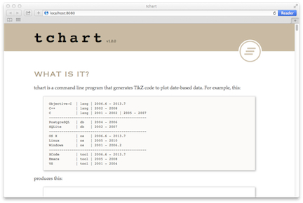

### What is tchart.doc?
The user documentation for tchart, a command line utility that generates TikZ code to draw a chart of date-based data.

### What where?

- The tchart.doc site is [here](http://milewgit.github.io/tchart.doc/).
- The tchart source code is [here](https://github.com/milewgit/tchart).

### Development Setup

#####Requirements:
- [OS X](https://www.apple.com/osx/)
- [VMware Fusion](http://www.vmware.com/ca/en/products/fusion)
- [Vagrant](http://www.vagrantup.com)
- [Vagrant VMware provider](https://www.vagrantup.com/vmware)
- An OS X Vagrant box named OSX109 (you can use a different name by changing the BOX variable near the top of the Vagrantfile downloaded in the Install step below)

#####Install:
In a terminal window on the host machine:
```
$ mkdir -p ~/work/tchart.doc
$ cd ~/work/tchart.doc
$ curl -fsSL https://raw.github.com/milewgit/tchart.doc/gh-pages/Vagrantfile -o Vagrantfile
$ vagrant up --provider=vmware_fusion
...
```

#####Check installation:
In a terminal window on the vm (guest machine):
```
$ cd ~/Documents/tchart.doc
$ ./_run
Started local web server at http://localhost:8080
Press Ctrl-C to stop.

```
Open a browser on the vm, go to http://localhost:8080 and you should see the following:



#####Uninstall:
**WARNING**: This will completely destroy the vm so you likely want to ensure that you have 
pushed any and all code changes to GitHub beforehand.

In a terminal window on the host machine:
```
$ cd ~/work/tchart.doc
$ vagrant destroy -f
$ cd ~
$ rm -r ~/work/tchart.doc    # and possibly rm -r ~/work if it is now empty
```


#####Development Notes:
- tchart.doc is hosted on [GitHub pages](https://pages.github.com).  As a result, there is only one git 
branch, gh-pages.  To do a deploy, simply do 'git push'.

- ./_build will convert embedded tchart specs in index.html into .jpg files.  The embedded tchart specs
  need to be between <!-- @tchart filename.jpg --> and <!-- @end -->.  For example:

  <!-- @tchart tutorial.jpg -->Objective-C  | lang | 2006.6 - 2013.7
  C++          | lang | 2002 - 2008
  C            | lang | 2001 - 2002 | 2005 - 2007
  <!-- @end -->

  Search index.html for @tchart to find all of the embedded charts.  Look at generate_charts() in the Rakefile
  to see how the embedded charts are extracted and converted.

- ./_run will launch a local web server.  Run ./\_run and launch a browser pointing to http://localhost:8080.
As you make and save changes to the source files (e.g. index.html), run ./_build and then refresh the
browser (Command-R, etc.) to see the results of your changes.

- If you wish to modify the Vagrantfile, it is best to do so on the host machine (~/work/tchart.doc/Vagrantfile) 
so that you can easily do an edit/vagrant up/vagrant destroy cycle.  Once you have finished making 
changes, vagrant up and then in a terminal window on the vm do something like:
    ```
    $ cd ~/Documents/tchart.doc
    $ cp /vagrant/Vagrantfile .
    $ git status
    ...
    $ git add Vagrantfile
    $ git commit -S -m "Insert description of change to Vagrantfile here."
    ...
    $ git push
    ...
    ```


### Thanks
- [Apple](http://www.apple.com)
- [GitHub](https://github.com) and [GitHub pages](http://pages.github.com)
- [Bundler](http://bundler.io)
- [TextMate](http://macromates.com)
- [Vagrant](https://www.vagrantup.com)
- [VMware](http://www.vmware.com)
